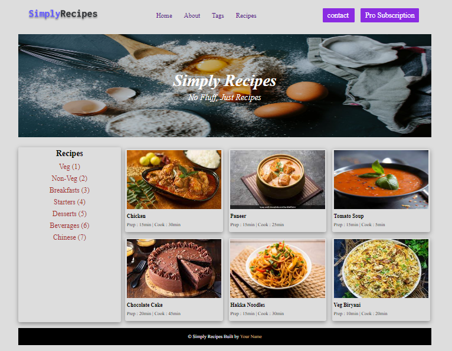

# **DOM ASSIGNMENT 5**

## **Task 1**

1.The user has to add one button beside contact button with the name **"Pro Subscription"**
2.Then in the recipes section user has to add one category with the name **"Chinese(7)"**
User has to add one custom card in the items/menu section

### **After Update**



### **Project Solution**

```js
// 1
let div = document.querySelectorAll(".nav-center div")[2];
let a = document.createElement("a");

a.className = "btn";
a.textContent = "Pro Subscription";
a.setAttribute("href", "#");

div.appendChild(a);

// 2
let textRecipe = document.getElementsByClassName("text-r")[0];
let div2 = textRecipe.nextElementSibling;

let a2 = document.createElement("a");
a2.textContent = "Chinese (7)";
a2.setAttribute("href", "#");

div2.appendChild(a2);

// 3
let recipe_gallery_div = document.getElementsByClassName("recipe-gallery")[0];

let div3 = document.createElement("div");
div3.className = "card";

let a3 = document.createElement("a");
a3.setAttribute("href", "#");
a3.className = "recipe-text";

let img = document.createElement("img");
img.className = "recipe-img";
img.setAttribute("src", "./img/recipe-6.jpg");

let h5 = document.createElement("h5");
h5.className = "recipe-name";
h5.textContent = "Veg Biryani";

let p = document.createElement("p");
p.className = "recipe-disp";
p.textContent = "Prep : 10min | Cook : 20min";

recipe_gallery_div.appendChild(div3);
div3.appendChild(a3);
a3.appendChild(img);
a3.appendChild(h5);
a3.appendChild(p);
```
