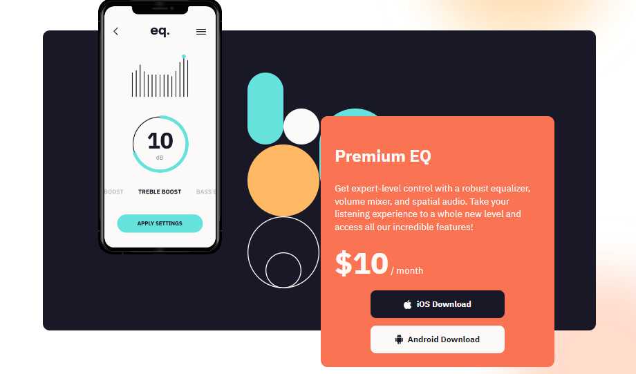

# **DOM ASSIGNMENT 6**

## **Task 1**

The user has to add change the logo.

### **After Update**


### **Project Solution**

```js
let logo = document.getElementsByClassName("logo")[0];
logo.src = "./assets/ineuron-logo.png";
```

## **Task 2**

The user has to add change the price from 4 to 10.

### **After Update**



### **Project Solution**

```js
let app_price = document.querySelector(".app_price span");
app_price.textContent = "$10";
```
