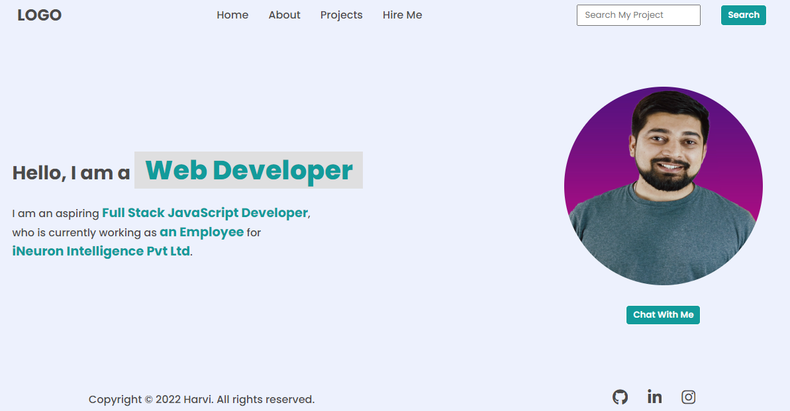

# **DOM ASSIGNMENT 1**

## **Task 1**

The user has to append a new element in the navigation menu named **"Hire Me"** and change the menu name **Contacts** to **Projects**.

### **After Update**


### **Project Solution**

```js
let ul = document.querySelector("ul");

let li = document.createElement("li");
let a = document.createElement("a");
a.textContent = "Hire Me";
a.setAttribute("href", "#");

li.appendChild(a);
ul.appendChild(li);

let ul2 = document.getElementsByTagName("ul")[0];
ul2.getElementsByTagName("li")[2].innerHTML = "Projects";
```

## **Task 2**

The user has to change the placeholder of search bar from **"Search"** to **"Searc My Project"**.

### **After Update**


### **Project Solution**

```js
let input = document.querySelector("input");
input.attributes[1].value = "Search My Project";
```

## **Task 3**

The user has to change the description of the Developer.

### **After Update**


### **Project Solution**

```js
let p = document.getElementsByTagName("p")[0];
p.getElementsByTagName("span")[1].innerText = "an Employee";
p.getElementsByTagName("span")[2].innerText = "iNeuron Intelligence Pvt Ltd";
```

## **Task 4**

The user has to change the photo/avatar.

### **After Update**



### **Project Solution**

```js
let img = document.querySelector("img");
img.setAttribute("src", "./hitesh_sir.jpg");
```

## **Task 5**

The user has to add new button with the name **"Support Me"**.

### **After Update**


### **Project Solution**

```js
let div = document.getElementsByClassName("hero-right-section-btns")[0];
let button = document.createElement("button");
button.textContent = "Support Me";
div.appendChild(button);
```

---

# **DOM ASSIGNMENT 2**

## **Task 1**

The user has to display the accordian text of last two elements and chnage the color of header of accordian.

### **After Update**


### **Project Solution**

```js
let accordion = document.querySelectorAll(".accordian h3");

accordion.forEach((elem, index) => {
  elem.style.backgroundColor = "#DDCFFF";
  if (index > 1) {
    let p = elem.nextElementSibling;
    p.style.display = "block";
  }
});
```

## **Task 2**

The user has to add new accordian with the name **"Skills"** and paragraph with some text in it and display it and rest accordian should be not displayed.

### **After Update**


### **Project Solution**

```js
let accordion = document.querySelectorAll(".accordian h3");

accordion.forEach((elem, index) => {
  elem.style.backgroundColor = "#DDCFFF";
});

let div = document.createElement("div");
div.className = "accordian";

let h3 = document.createElement("h3");
h3.textContent = "Skills";
h3.style.backgroundColor = "#DDCFFF";

let p = document.createElement("p");
p.textContent =
  "I posses a very good command over the Full Stack Development technologies like MERN which can be seen in my work over the Github.";
p.style.display = "block";

div.appendChild(h3);
div.appendChild(p);

let accordianWrapper = document.getElementsByClassName("accordian-wrapper")[0];
accordianWrapper.appendChild(div);
```

---

# **DOM ASSIGNMENT 3**

## **Task 1**

The user has to add the text in the input fields.

### **After Update**


### **Project Solution**

```js
let enterName = document.querySelector(".enterName");
let enterMail = document.querySelector(".enterMail");
let enterMessage = document.querySelector(".enterMessage");

enterName.setAttribute("value", "FSJS 2.0");
enterMail.setAttribute("value", "fsjs@ineuron.ai");
enterMessage.innerText = "Hello World";

let userName = document.querySelector(".userName");
let userEmail = document.querySelector(".userEmail");
let userMessage = document.querySelector(".userMessage");

userName.setAttribute("value", "FSJS 2.0");
userEmail.setAttribute("value", "fsjs@ineuron.ai");
userMessage.innerText = "Hello World";
```
