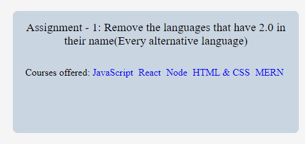
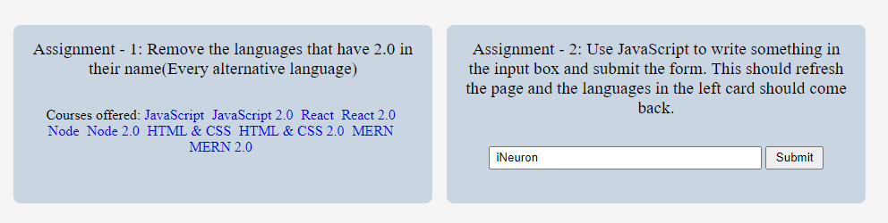

# **DOM ASSIGNMENT 7**

## **Task 1**

The user has to remove the languages that have 2.0 in their name.

### **After Update**



### **Project Solution**

```js
let main_languages = document.querySelector(".main__languages");
let a = document.querySelectorAll(".main__languages a");

a.forEach((elem, index) => {
  if (index % 2 !== 0) {
    elem.style.display = "none";
  }
});
```

## **Task 2**

The user has to make the input tag and submit button non-disabled and on submit he has to get the languages back which were removed in previous task.

### **After Update**



### **Project Solution**

```js
let input = (document.getElementsByClassName(
  "main__form-input"
)[0].disabled = false);
let btn = document.getElementsByClassName("main__form-btn");
btn[0].disabled = false;

btn[0].addEventListener("click", getText);

function getText(e) {
  e.preventDefault();
  a.forEach((elem, index) => {
    if (index % 2 !== 0) {
      elem.style.display = "inline";
    }
  });
}
```
