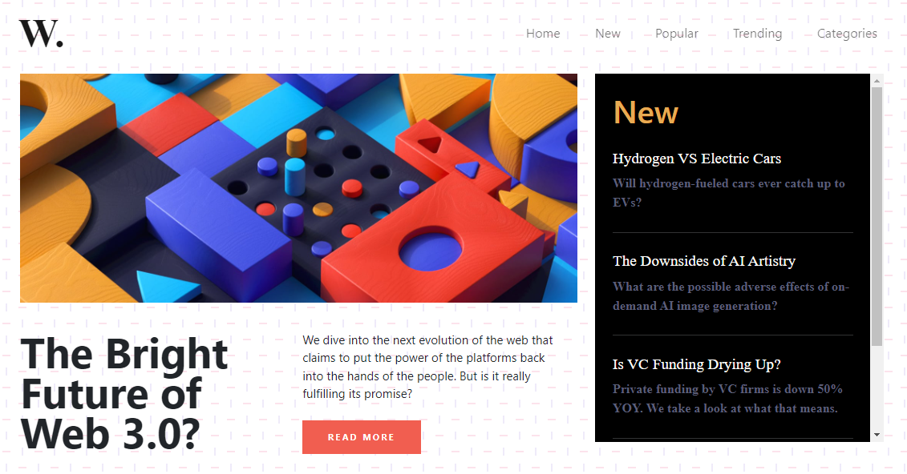
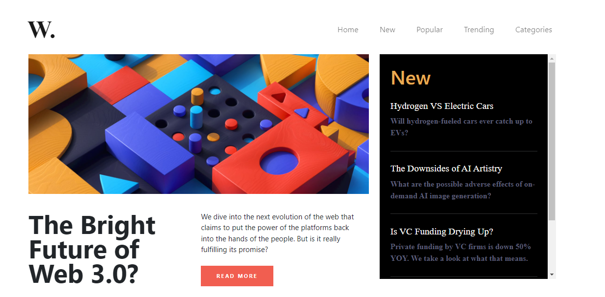
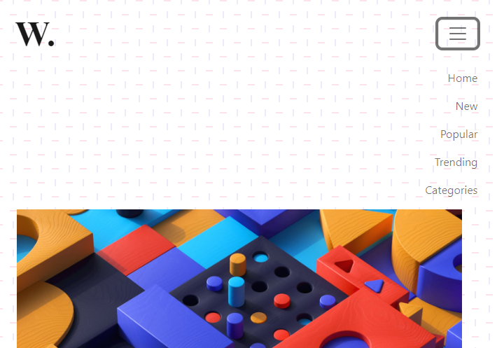

# **DOM ASSIGNMENT 8**

## **Task 1**

The user has to add scroll bar on the aside section and one custom data.

### **After Update**



### **Project Solution**

```js
let aside = document.getElementsByClassName("new")[0];
aside.style.overflowY = "scroll";

let hr = document.createElement("hr");
hr.className = "hr-line";

let h2 = document.createElement("h2");
h2.className = "new-head";
h2.textContent = "This is my custom heading !";

let p = document.createElement("p");
p.className = "new-p";
p.textContent =
  "Lorem this is my custom paragraph. This is great course and assignments.";

aside.appendChild(hr);
aside.appendChild(h2);
aside.appendChild(p);
```

## **Task 2**

The user has to remove the background image.

### **After Update**



### **Project Solution**

```js
document.body.style.background = "#fff";
```

## **Task 3**

The user has to add toggle functionality i.e. onclick on the menu icon the list of menus should be displayed.

### **After Update**



### **Project Solution**

```js
let toggler = document.querySelector(".navbar-toggler");

toggler.addEventListener("click", () => {
  let btn = document.getElementById("navbarTogglerDemo01");

  btn.classList.forEach((className) => {
    if (className === "collapse") {
      btn.classList.remove("collapse");
    } else {
      btn.classList.add("collapse");
    }
  });
});
```
